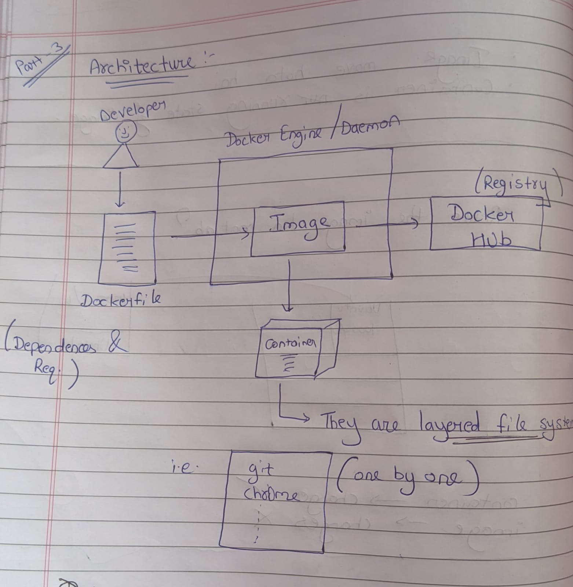

# Docker

- Docker is an open-source centralized platform designed to create, deploy, and run applications.
- Docker uses containers on the host operating system to run applications. It allows applications to use the same Linux kernel as the system on the host computer rather than creating a whole virtual OS.
```
Containers?
A container is a bundle of Application, Application libraries required to run your application and the minimum system dependencies.
```
- Docker can be installed on any OS, but the Docker engine runs natively on Linux distributions.
- Docker is written in Go language.
- Docker is a tool that performs OS-level virtualization, also known as containerization.
- Before Docker, many users faced the problem that a particular code was running on the developer's system but not on the user's system.
- Docker was first released in March 2013. It was developed by Solomon Hykes and Sebastian Pahl.
- Docker is a set of platform as a service that uses OS-level virtualization, whereas VMware uses hardware-level virtualization.

## Containers vs Virtual Machine 
Containers and virtual machines are both technologies used to isolate applications and their dependencies, but they have some key differences:

1. **Resource Utilization:** Containers share the host operating system kernel, making them lighter and faster than VMs. VMs have a full-fledged OS and hypervisor, making them more resource-intensive.
2. **Portability:** Containers are designed to be portable and can run on any system with a compatible host operating system. VMs are less portable as they need a compatible hypervisor to run.
3. **Security:** VMs provide a higher level of security as each VM has its own operating system and can be isolated from the host and other VMs. Containers provide less isolation, as they share the host operating system.
4. **Management:** Managing containers is typically easier than managing VMs, as containers are designed to be lightweight and fast-moving.
>>>>>>> 47e08a9f422bc61380894aa7595849df6e04a859:Docker/1_Docker_Introduction.md


## Advantages:

1) No free allocation of RAM.
2) CI efficiency → Docker enables you to build a container image and use that same image across every step of the deployment process.
3) Less cost.
4) It is lightweight.
5) It can run on physical hardware/virtual hardware.
6) You can reuse the image.

## Limitations:

- Docker is not a good solution for applications that require a rich GUI.
- Difficult to manage a large number of containers.
- Docker does not provide cross-platform compatibility, meaning if an application is designed to run in a Docker container on Windows, then it can't run on Linux or vice versa.
- Docker is suitable when the development OS and testing OS are the same; if the OS is different, we should use VM.
- No solution for data recovery and backup.

## Docker Architecture


### 1) Docker Daemon

- Docker Daemon run on host OS.
- It is responsible for running containers to mangage docker services.
- Docker daemon can run communicate with other daemons.

### 2) Docker Client
- Docker user can interact with docker demon using docker client.
- Docker client uses commands and rest API to communicate with docker daemon.
- When a client runs any server command on the client terminal, the client terminal will send these docker commands to the docker daemon.
- It is possible for the docker client to communicate with more than one docker daemon.

### 3) Docker Host
- Docker host is used to provide an environment to execute and run application.  
- It contains a darker daman, images, containers, network, & storage

### 4) Docker hub
- Docker registry stores and manages the docker images.  
- There are 2 types of registry in docker hub:- 
1) **Public Registry:**  Also called as Docker Hub.
2) **Private Registry:** It is used to share images within organisation.

### 4) Docker Images
Doctor images are read only binary templates which are used to create containers.
OR
Single file with all the dependencies and configuration required to run a program.
> Ways to create Docker Image
>1) Take image from docker hub.
>2) Create Image from Docker File.
>3) Create image from existing docker containers.

### 5) Docker Container
- A container is a bundle of Application, Application libraries required to run your application and the minimum system dependencies.
- Container is an instance of the image.

