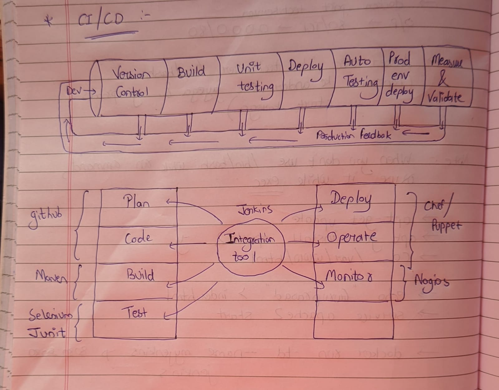
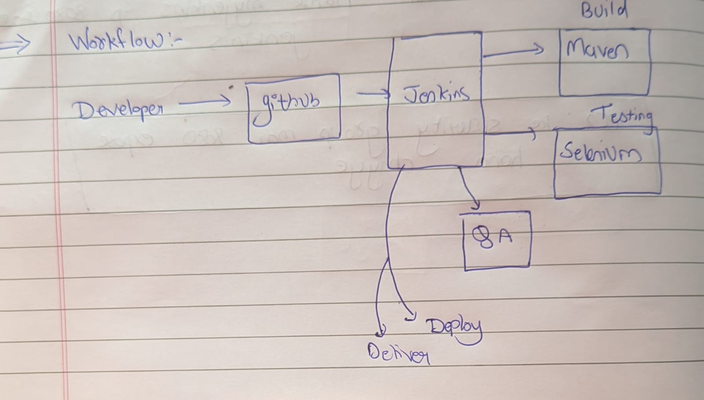
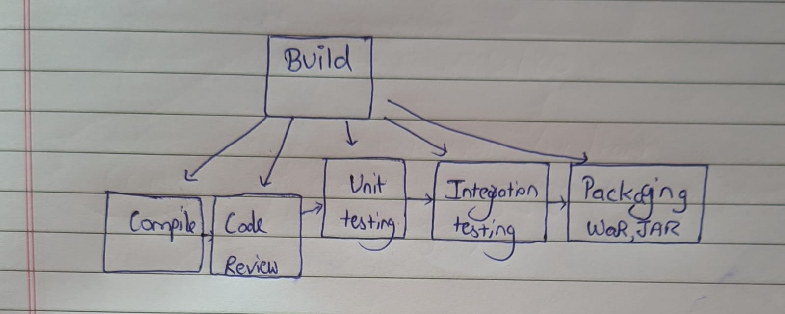

# Introduction 

- Jenkins is ajj open source project written in Java that runs in windows, Mac OS and other Unix like operating system. It is free, community supported, and might be your first choice tool for CI.
- Jenkins automate the entire software development life cycle.
- Jenkins was originally developed by sun microsystem in 2004 under the name of Hudson.
- The project was later name Jenkins when Oracle bought microsystems.
- It can run on any major platform without any compatibility issues.
- Whenever developer right code, we integrate all that code of all the developers at that point of time and then frequently build, test, and deliver / deploy to the client. This process is called CI/CD, jenkins help us to achieve this. 
- Because of CI now bugs will be reported fast and get rectified fast so the entire software development happens to be fast.

## Workflow

- We can attach git, Maven, selenium and antifactory plugins to Jenkins.
- Once developers put code on github, jenkin pull that code and send it to Maven for build.
- Once build is done Jenkins pull that code and sent to selenium for testing
- Once testing is done then Jenkins will pull that code and send to artifactory (archiving purpose) as per the requirement and so on.
- We can also deploy with Jenkins.
